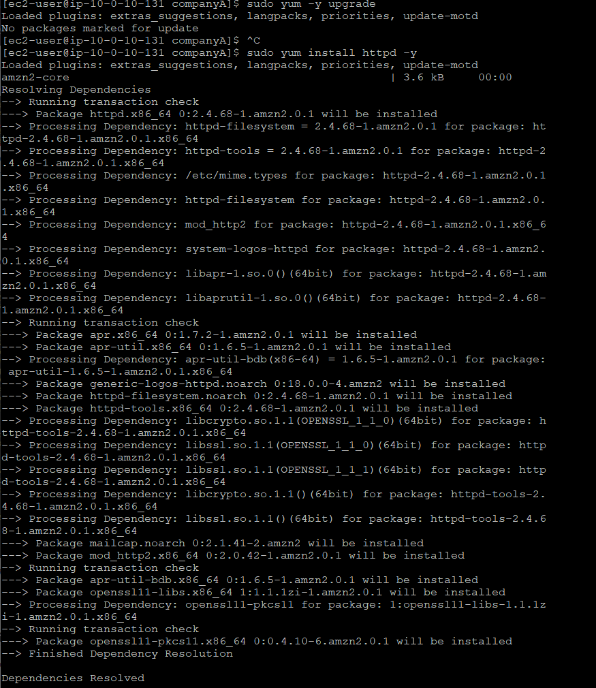
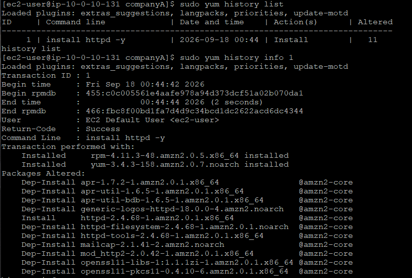
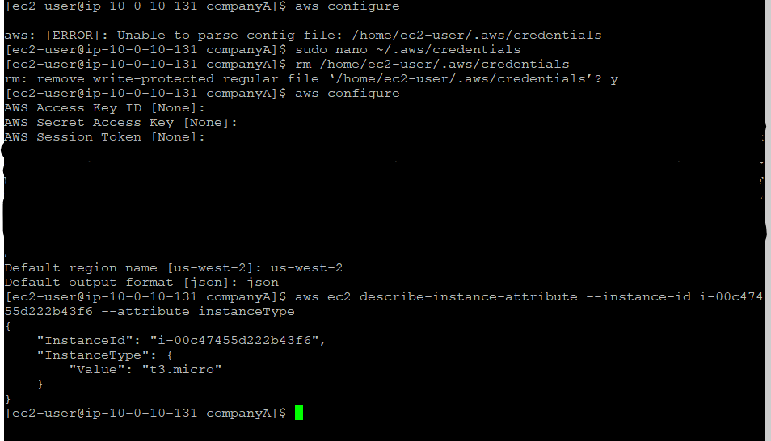

# 🚀 Laboratório: Gerenciamento de Software e AWS CLI no Amazon Linux

Repositório criado para documentar a atividade práticas de administração de sistemas Linux e integração com os serviços da AWS, desenvolvida durante a formação na **Escola da Nuvem**.

---

## 🎯 Objetivos do Laboratório
Neste laboratório, foram abordados os seguintes tópicos práticos:
* Atualização do sistema operacional Linux utilizando o gerenciador de pacotes `yum`.
* Auditoria e reversão (*rollback*) de pacotes utilizando o histórico de transações (`yum history`).
* Instalação manual e configuração da **AWS CLI (v2)** em uma instância Amazon EC2.
* Execução de chamadas diretas à API da AWS via terminal para inspecionar atributos de recursos.

---

## 🛠️ Tecnologias e Ferramentas Utilizadas
* **Amazon Linux (EC2)** / Ambiente Linux
* **Yum Package Manager** (`yum`, `yum history`)
* **AWS CLI v2**
* **Git & GitHub**

---

## 📋 Passo a Passo Executado

### ✅ 1. Conexão SSH e Gerenciamento de Pacotes (`yum`)
* Conexão remota à instância Amazon EC2 via SSH utilizando chave PEM.
* Atualização controlada do sistema e aplicação de patches de segurança:
  ```bash
  sudo yum -y upgrade
  sudo yum install httpd -y



### ✅ 2. Controle de Histórico e Rollback
* Listagem e auditoria das transações executadas no sistema operacional:
  ```bash
  sudo yum history list
  sudo you history info 1



### ✅ 3. Instalação da AWS CLI
* Download, descompactação e instalação da AWS CLI v2 via terminal:
  ```bash
  curl "[https://awscli.amazonaws.com/awscli-exe-linux-x86_64.zip](https://awscli.amazonaws.com/awscli-exe-linux-x86_64.zip)" -o "awscliv2.zip"
  unzip awscliv2.zip
  sudo ./aws/install


### ✅ 4. Configuração da AWS CLI e Credenciais
* Inicialização da configuração padrão:
  ```bash
  aws configure



### ✅ 5. Inspeção de Infraestrutura via Linha de Comando
* Obtenção do ID da instância EC2 (Command Host) no Console da AWS.
* Execução de comando para descrever os atributos da instância diretamente pelo terminal:
  ```bash
  aws ec2 describe-instance-attribute --instance-id <instance-id> --attribute instanceType

* Retorno esperado da API (JSON):
  ```bash
  JSON
  {
    "InstanceId": "i-00c47455d222b43f6",
    "InstanceType": {
        "Value": "t3.micro"
    }
  }


## 💡 Principais Aprendizados
* Domínio do Gerenciamento de Pacotes: Compreensão de como aplicar atualizações de segurança e gerenciar o ciclo de vida de softwares no Amazon Linux com o comando yum.

* Auditoria e Segurança Operacional: Importância do uso do yum history para rastrear transações e realizar reversões (rollbacks) com segurança em caso de falhas ou incompatibilidades.

* Automação via CLI: Capacidade de interagir diretamente com os recursos da nuvem AWS usando a linha de comando, sem depender exclusivamente da console gráfica.

* Visão Sistêmica: Entendimento de que gerenciar uma instância EC2 vai muito além de provisionar máquinas, exigindo autonomia no sistema operacional e habilidade de inspeção de atributos via API.


## Tecnologias
<p>
  
  
  
  
  
  
  
</p>
  
